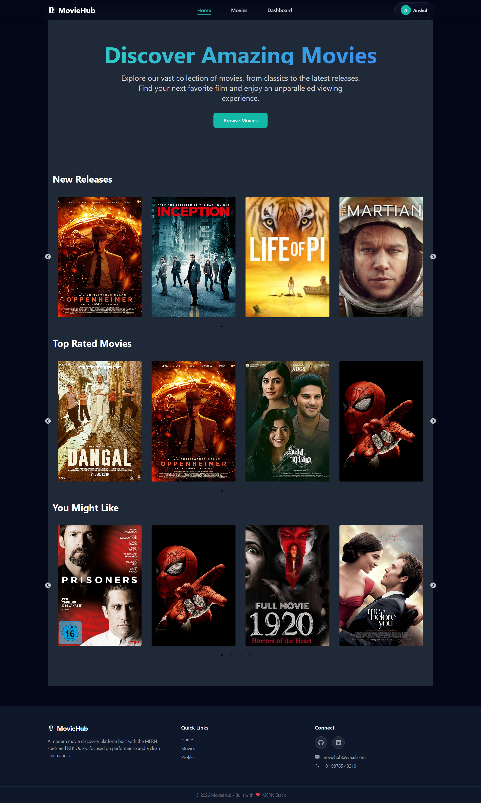
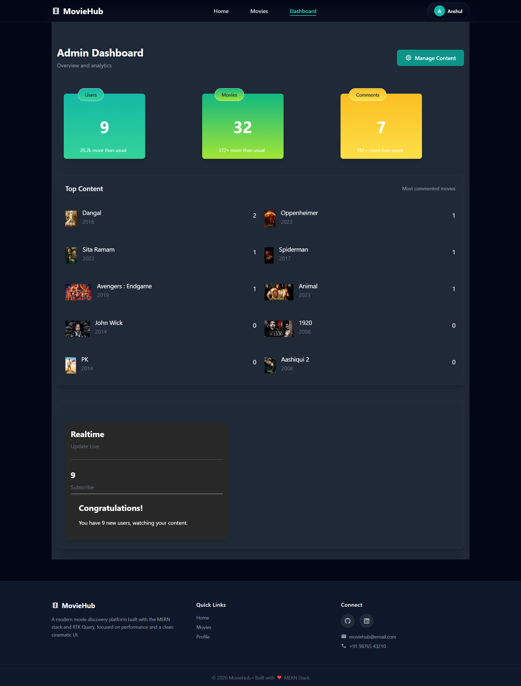
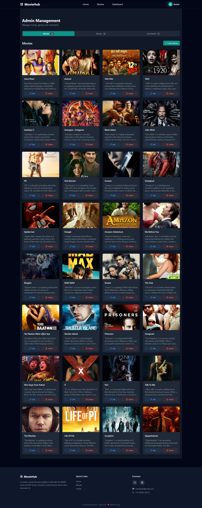
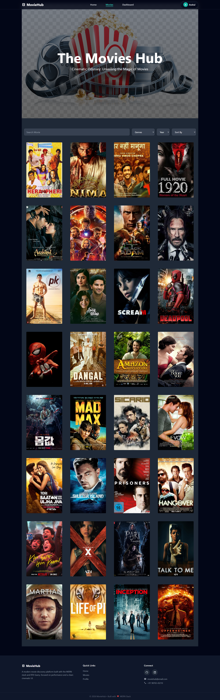

# 🎬 Movies Discovery Portal

A **production‑grade full‑stack MERN application** designed for discovering, filtering, and managing movies with a strong emphasis on **performance, scalability, and user experience**. The platform serves both end‑users and administrators through a clean UI and secure, role‑based workflows.

---

## 🎥 Project Walkthrough (Introductory Videos)

To  quickly understand both perspectives of the application, separate walkthrough videos are provided for **Users** and **Administrators**.

### 👤 User Walkthrough

* ▶️ **User Flow Demo:**
  [https://res.cloudinary.com/dyqa7ohun/video/upload/v1767506691/Introductory_Video-_User_sxr1f3.mkv](https://res.cloudinary.com/dyqa7ohun/video/upload/v1767506691/Introductory_Video-_User_sxr1f3.mkv)
* Covers movie discovery, filtering, movie details, reviews, and responsive UI behavior.

### 🛠️ Admin Walkthrough

* ▶️ **Admin Dashboard Demo:**
  [https://res.cloudinary.com/dyqa7ohun/video/upload/v1767506727/Introductory_Video-_Admin_puwxjr.mkv](https://res.cloudinary.com/dyqa7ohun/video/upload/v1767506727/Introductory_Video-_Admin_puwxjr.mkv)
* Covers authentication, role-based access, movie & genre management, and comment moderation.

---

## ✨ Key Features

### 🎯 Advanced Movie Discovery

* Filter movies by **Genre**, **Release Year**, and curated categories:

  * *Top Rated*
  * *New Releases*
  * *Random Picks*
* Optimized client‑side filtering for fast navigation

### 🔐 Role‑Based Access Control (RBAC)

* **Admin Capabilities**

  * Add, update, and delete movies
  * Create and manage genres
  * View and moderate user reviews
  * Access protected admin‑only APIs

* **User Capabilities**

  * Browse and explore movies
  * View detailed movie pages
  * Submit ratings and written reviews

### 📊 Admin Dashboard

* Centralized dashboard for content management
* Intuitive UI for handling movies, genres, and comments
* Designed to reduce manual administrative effort

### 🛡️ Secure Authentication & Authorization

* JWT‑based authentication
* Password hashing using **bcrypt**
* HTTP‑only cookies for secure session handling
* Protected routes for admin and user workflows

### 🖼️ Media Management

* **Cloudinary** integration for secure and optimized image storage
* Fast image loading with CDN support

### ⚡ State Management & Performance

* **Redux Toolkit** for predictable global state
* **RTK Query** for efficient API calls, caching, and automatic re‑fetching
* Reduced redundant network requests and improved UI responsiveness

### 📱 Responsive UI

* Fully responsive design
* Seamless experience across **desktop, tablet, and mobile** devices
* Smooth animations and transitions for better UX

---

## 🛠️ Tech Stack

| Layer        | Technologies                                                   |
| ------------ | -------------------------------------------------------------- |
| **Frontend** | React.js, Redux Toolkit, RTK Query, React Router, Tailwind CSS |
| **Backend**  | Node.js, Express.js                                            |
| **Database** | MongoDB, Mongoose                                              |
| **Auth**     | JWT, bcrypt                                                    |
| **Media**    | Cloudinary                                                     |

---

## 📸 Application Screenshots

### 🏠 Homepage



### 🛠️ Admin Dashboard


## To Create and update Movies , Genres and Comments .


### 🎥 Movie Details & Filtering



---

## 🔗 Live Demo & Source Code

* 🌐 **Live Application:**
  [https://movieappps.netlify.app](https://movieappps.netlify.app)

* 💻 **GitHub Repository:**
  [https://github.com/Anuj-jnv/moviedeployment](https://github.com/Anuj-jnv/moviedeployment)

---

## ⚙️ Local Setup Instructions

### Prerequisites

* Node.js (v18 or higher)
* MongoDB

### Clone the Repository

```
git clone https://github.com/Anuj-jnv/moviedeployment.git
cd MovieAppDeployment
```

### Backend Setup

```
cd backend
npm install
npm run dev
```

### Frontend Setup

```
cd frontend
npm install
npm run dev
```

### Environment Variables

Create a `.env` file in the backend directory:

```
MONGO_URI=your_mongodb_uri
JWT_SECRET=your_jwt_secret
CLOUDINARY_NAME=your_cloudinary_name
CLOUDINARY_API_KEY=your_cloudinary_key
CLOUDINARY_API_SECRET=your_cloudinary_secret
FRONTEND_URL=your_frontend_url
```

---

## 📈 Future Enhancements

* Watchlist & favorites feature
* Global search with debouncing
* Pagination and infinite scrolling
* Personalized movie recommendations
* Unit and integration testing

---

## 👨‍💻 Author

**Anuj Kumar**
Full‑Stack Developer
Focused on building scalable, secure, and high‑performance web applications.

---

## ⭐ Support

If you find this project useful, please consider giving it a ⭐ on GitHub.
